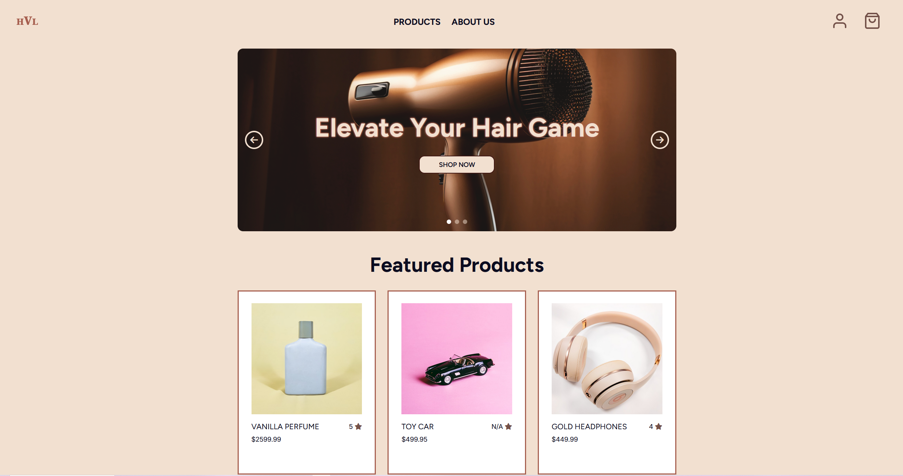

# Project Exam 1: HotView Labs

## Overview
The main objective for this project is to build a front-end user interface for an existing e-commerce API. The client, HotView Labs, requires a responsive web application that allows users to view products, log in to purchase products, and log out after checking out.

## Features
- **Product Browsing**: View featured products on the homepage with an interactive carousel
- **Product Details**: Detailed product pages with customer reviews, ratings, and share functionality
- **User Authentication**: Register and login system with form validation
- **Shopping Cart**: Add products to cart with quantity controls and price calculations
- **Checkout**: Complete checkout process with multiple payment options (Card, Klarna, Vipps)
- **Responsive Design**: Fully responsive across all device sizes
- **Dynamic Notifications**: Styled notifications for cart updates and share actions

## Built With
- HTML
- CSS
- JavaScripte
- Noroff Shop API
- Font Awesome Icons
- Google Fonts (Figtree & Inter)

## Installation
1. Clone the repository bash git https://github.com/meluhrose/meluhrose.github.io
2. Open the repository: bash cd meluhrose.github.io
3. Open `index.html` in a web browser

## API Integration
The project uses the Noroff Shop API:
- **Endpoint**: `https://v2.api.noroff.dev/online-shop`
- Fetches product data including images, prices, descriptions, and reviews
- No authentication required for product browsing

## Figma Design

Desktop: `https://www.figma.com/proto/gryZbNVklFWtBQYZxpvYid/HotView-Labs?node-id=7-603&t=tf6fV12AYdIEdYBz-1`
Mobile: `https://www.figma.com/proto/gryZbNVklFWtBQYZxpvYid/HotView-Labs?node-id=336-2044&t=tf6fV12AYdIEdYBz-1`
Style Guide: `https://www.figma.com/proto/gryZbNVklFWtBQYZxpvYid/HotView-Labs?node-id=37-85&t=tf6fV12AYdIEdYBz-1`
Wireframe: `https://www.figma.com/proto/gryZbNVklFWtBQYZxpvYid/HotView-Labs?node-id=3-2&t=tf6fV12AYdIEdYBz-1`

## Test Login
Use this test user to check authentication: 

Email: james.smith@example.com
Password: Password1

## License
Educational project for Noroff School of Technology and Digital Media

## Contact

Milagros Vasshus
Email: meluhrose@gmail.com

Project Link: meluhrose.github.io
